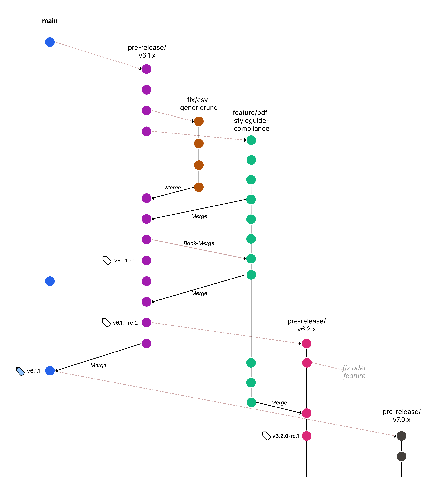

# Contributing

## Code of Conduct

The project has a code of conduct ([Code of Conduct](CODE_OF_CONDUCT-en.md))
to which all contributors must adhere.

## Direct participation

Feedback and contributions are very welcome! You can actively contribute to this repository, e.g. with merge requests, questions, or documentation.

### Application questions or suggestions (issues)

If you have any questions about this project or would like to make suggestions for its further development or customisation, we encourage you to create an issue in our repository. Issues are a central part of our project as they allow us to discuss open questions, gather feedback and explore new ideas or improvements.

#### Creating an issue

To simplify and standardise the creation and processing of issues, we provide specific issue templates. These templates help you to formulate your questions or suggestions in a clear and structured way. Please select the appropriate template for your enquiry:

- **Bug report:** If you discover application errors (bugs) or other errors, e.g. in the documentation, please use our [bug report template](https://gitlab.opencode.de/bmi/ozg-rahmenarchitektur/ozgsec/ozgsec-web-frontend/-/issues/new?issuable_template=bug-en).

- **Feature requests or suggestions for improvement:** For suggestions for extending the project or implementing new functions, please use our [feature request template](https://gitlab.opencode.de/bmi/ozg-rahmenarchitektur/ozgsec/ozgsec-web-frontend/-/issues/new?issuable_template=feature-en).

Fill in all the required fields of the template. The more detailed your description, the better we can respond to your request. Our community or team will review the issue and respond accordingly.

We appreciate your contributions to the continuous improvement of this project!

### Concrete changes: Feature Branch Workflow and Merge Requests

In this project, we use the so-called Feature Branch Workflow in development. This process ensures that the source code of the project remains stable and that changes can be checked quickly. Only one specific feature or improvement is processed on each branch. 



Here is a brief guide on how to use this workflow:

1. Create a feature branch: before you start working on a new feature or fix, [create a new branch](https://gitlab.opencode.de/bmi/ozg-rahmenarchitektur/ozgsec/ozgsec-web-frontend/-/branches/new) checkout out from the `main` branch. Name your branch in a way that clearly describes the feature or fix (e.g. `feature/scan-dkim` or `fix/http-timeout`).

2. Development in your branch: Make your changes in your feature branch. Keep your commits (save points/changes) small and focussed, and make sure that each commit represents a logical unit of work. Briefly describe the changes you have made in the respective commit in the commit message. 

3. Create a Merge Request (MR): Once you are ready to present your changes for review, create a [Merge Request](https://gitlab.opencode.de/bmi/ozg-rahmenarchitektur/ozgsec/ozgsec-web-frontend/-/merge_requests/new) against the `main` branch of the project. In your MR, you should include a clear description of your changes, the purpose of the feature or fix, and any relevant details or screenshots. You can also create an MR early on to get feedback on your changes while you are still working on them. In this case, please mark your MR as a draft.

4. Code review and discussion: Other project members will review your code. Be open to feedback and discussion.

5. Transfer to the main branch: After your MR has been approved, it will be merged into the ‘main’ branch. Your changes are now part of the main project!

### Developer Certificate of Origin (DCO)

For all contributions (including merge requests), the person making the contribution must agree to the [Developer Certificate of Origin (DCO) Version 1.1](./docs/dco.txt). This certificate of origin is identical to that of the Linux kernel developers and was published by the Linux Foundation at <http://developercertificate.org/>. Kernel is the confirmation of a developer that he or she has the right to submit the patch for inclusion in the project.

Submitting a contribution implies agreement to the DCO. However, please include a ‘signed-off-by’ tag in each patch (this tag is a common way to confirm that you agree to the DCO). You can do this with `git commit --signoff -m ‘<message>’` (short form: `-s` flag).

Another option is to write the following at the end of the commit message on a separate line, after the description, separated by a blank line:

````text
Signed-off-by: YOUR NAME <EMAIL@EXAMPLE.COM>
````

You can sign off by default by creating a file (e.g. ‘git-template’) that contains a few blank lines and the above signed-off-by text;
then configure git to use this file as a commit template.

````sh
git config commit.template ~/.git-template
````

It is not practical to correct old contributions in Git. If a ‘signed-off-by’ tag has been forgotten, do not try to correct it. 
We presume that if someone sometimes used a DCO,
a commit without a DCO is an accident and the DCO still applies.

### Licence (EUPL-1.2)

All (new) contributions to the source code must
be published under the [EUPL-1.2](./LICENSE) licence.

## Reporting vulnerabilities

Please report any vulnerabilities you find privately so that we can fix them!

See [SECURITY.md](./SECURITY-en.md) for information on reporting vulnerabilities.

## Code changes

Code should be DRY (don't repeat yourself), clear and obviously correct. Some technical debt is unavoidable, but please minimise it as much as possible.
Improved refactorizations are welcome.

### Automated tests

If you add or change features, please add new tests for these features as part of your contribution.

We recommend creating tests first and then adding code (also known as test-driven development).

### Security, privacy and performance

Pay attention to security and work *with* (not against) our security mechanisms. Protect private information. If possible, avoid mechanisms that could be used for tracking.

You can find out more about security at [security](./SECURITY-en.md).

We want the software to perform adequately for typical users. Use caching to improve performance in typical cases.

There is always a trade-off to be made between different characteristics: specifically, performance should not be prioritised in a way that makes the software difficult to maintain. Instead, strive for ‘reasonable’ performance.

## Reuse (supply chain)

### Requirements for reused components

We favour reusing components rather than writing lots of code, but please evaluate all new components before adding them (including whether you really need them or not). We want to reduce the risk of being dependent on software that is poorly maintained or has (intentional or unintentional) vulnerabilities.

Favour software that is actively maintained, has more than one developer working on it, and uses good practices.

#### Licence requirements for reused components

Reused software *must* be open source software (OSS). We use ‘licence_finder’ to make sure we are using OSS legally.

In general, we want to use GPL-compatible OSS licences.

You can find out more about licence decisions at [docs/dependency_decisions.yml](./docs/dependency_decisions.yml).

Once you have checked this, you can approve a library and your licence with the following command:

````sh
licence_finder approval add --who=WHO --why=WHY DEPENDENCY --decisions_file ./docs/dependency_decisions.yml
````

### Updating reused components

Please update only one or a few components with each commit, instead of ‘all at once’. This makes it easier to debug problems.

## Acknowledgements

This document is based on the [CONTRIBUTING.md](https://github.com/coreinfrastructure/best-practices-badge/blob/main/CONTRIBUTING.md) of the [OpenSSF Best Practices Badge Programme - BadgeApp](https://www.bestpractices.dev/en) (CC BY 3.0).
