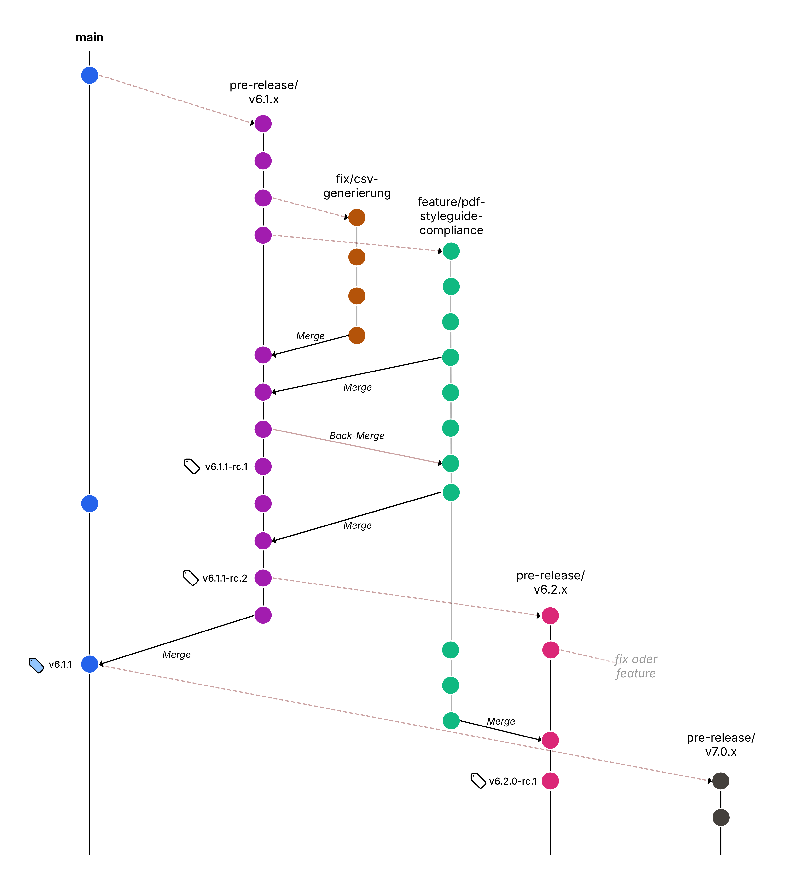

# Beitragen

## Code of Conduct

Das Projekt hat einen Verhaltenskodex ([Code of Conduct](CODE_OF_CONDUCT.md))
an den sich alle Mitwirkenden halten müssen.


## Direkte Mitwirkung

Wir freuen uns über Ihre Mitarbeit! Sie können sich aktiv, z. B. mit Änderungsvorschlägen (Merge Requests), Fragen oder Dokumentation hier in diesem Repository einbringen.


### Anwendungsfragen bzw. Vorschläge (Issues)

Wenn Sie Fragen zu diesem Projekt haben oder Vorschläge für Ihre Weiterentwicklung oder Anpassung machen möchten, ermutigen wir Sie, ein Issue in unserem Repository zu erstellen. Issues sind ein zentraler Bestandteil unseres Projekts, da sie es uns ermöglichen, offene Fragen zu diskutieren, Feedback zu sammeln und neue Ideen oder Verbesserungen zu erkunden.

#### Erstellen eines Issues

Um die Erstellung und Bearbeitung von Issues zu vereinfachen und zu standardisieren, haben wir spezifische Issue-Templates eingerichtet. Diese Templates helfen Ihnen, Ihre Fragen oder Vorschläge klar und strukturiert zu formulieren. Wir bitten Sie, das entsprechende Template für Ihre Anfrage auszuwählen:

- **Fehlerreport:** Wenn Sie Anwendungsfehler (Bugs) oder andere Fehler z. B. in der Dokumentation entdecken, verwenden Sie bitte unser [Fehlerreport-Template](https://gitlab.opencode.de/bmi/ozg-rahmenarchitektur/ozgsec/ozgsec-web-frontend/-/issues/new?issuable_template=bug).

- **Feature-Anfragen oder Verbesserungsvorschläge:** Für Vorschläge zur Erweiterung des Projekts oder zur Implementierung neuer Funktionen nutzen Sie bitte unser [Weiterentwicklungs-/Anpassungsanfrage-Template](https://gitlab.opencode.de/bmi/ozg-rahmenarchitektur/ozgsec/ozgsec-web-frontend/-/issues/new?issuable_template=feature).

Füllen Sie alle erforderlichen Felder des Templates aus. Je detaillierter Ihre Beschreibung, desto besser können wir auf Ihr Anliegen eingehen. Unsere Community oder unser Team wird sich das Issue ansehen und entsprechend darauf reagieren.

Wir schätzen Ihre Mitarbeit und Ihre Beiträge zur kontinuierlichen Verbesserung dieses Projekts!


### Konkrete Änderungsvorschläge: Feature Branch Workflow und Merge Requests

In diesem Projekt verwenden wir den sogenannten Feature Branch Workflow für alle Entwicklungen. Dieser Prozess sorgt dafür, dass der Quelltext des Projekts stabil bleibt und Änderungen schnell überprüft werden können. Auf jedem Feature Branch wird nur eine konkrete Neuerung bzw. Verbesserung bearbeitet. 



Hier ist eine kurze Anleitung, wie Sie diesen Workflow nutzen können:

1. Erstellen eines Feature Branches: Bevor Sie mit der Arbeit an einem neuen Feature oder einer Korrektur beginnen, [erstellen Sie einen neuen Branch](https://gitlab.opencode.de/bmi/ozg-rahmenarchitektur/ozgsec/ozgsec-web-frontend/-/branches/new) ausgehend vom `main`-Branch. Benennen Sie Ihren Branch in einer Weise, die das Feature oder die Korrektur klar beschreibt (z. B. `feature/scan-dkim` oder `fix/http-timeout`).

2. Entwicklung in Ihrem Branch: Führen Sie Ihre Änderungen in Ihrem Feature Branch durch. Halten Sie Ihre Commits (sozusagen Speicherpunkte/ Änderungen) kleinschrittig und fokussiert, und stellen Sie sicher, dass jeder Commit eine logische Einheit der Arbeit darstellt. Beschreiben Sie Ihre Änderungen, welche Sie in dem jeweiligen Commit gemacht haben, kurz inhaltlich in der Commit-Message. 

3. Erstellen eines Merge Requests (MR): Sobald Sie bereit sind, Ihre Änderungen zur Überprüfung vorzustellen, erstellen Sie einen [Merge Request](https://gitlab.opencode.de/bmi/ozg-rahmenarchitektur/ozgsec/ozgsec-web-frontend/-/merge_requests/new) gegen den `main` Branch des Projekts. In Ihrem MR sollten Sie eine klare Beschreibung Ihrer Änderungen, den Zweck des Features oder der Korrektur und eventuell relevante Details oder Screenshots beifügen. Sie können auch schon frühzeitig einen MR erstellen, um Feedback zu Ihren Änderungen zu erhalten, während Sie noch daran arbeiten. In diesem Fall markieren Sie bitte Ihren MR als Entwurf (Draft).

4. Code Review und Diskussion: Andere Projektmitglieder werden Ihren Code überprüfen. Seien Sie offen für Feedback und Diskussionen.

5. Übernahme in den Hauptbranch: Nachdem Ihr MR genehmigt wurde, wird er in den `main` Branch übernommen. Dies bedeutet, dass Ihre Änderungen nun Teil des Hauptprojekts sind.

### Herkunftsnachweis für Entwickler - Developer Certificate of Origin (DCO)

Für alle Beiträge (einschließlich Merge-Requests) muss die einbringende Person dem [Developer Certificate of Origin (DCO) Version 1.1](./docs/dco.txt) zustimmen. Dieser Herkunftsnachweis ist identisch mit dem der Linux-Kernel-Entwicklenden und wurde von der Linux-Foundation auf <http://developercertificate.org/> veröffentlicht. Kern ist die Bestätigung einer Entwicklerin bzw. eines Entwicklers, dass er oder sie das Recht hat, den Patch zur Aufnahme in das Projekt einzureichen.

Das Einreichen eines Beitrags impliziert die Zustimmung zu dem Herkunftsnachweis. Bitte fügen Sie jedoch in jeden Patch ein „Signed-off-by“-Tag ein (dieses Tag ist ein üblicher Weg, um zu bestätigen, dass Sie dem DCO zustimmen). Sie können dies mit `git commit --signoff -m "<Message>"` tun (Kurzform: `-s` Flag).

Eine andere Möglichkeit besteht darin, das Folgende am Ende der Commit-Nachricht in eine eigene Zeile zu schreiben, die durch eine Leerzeile von der Beschreibung getrennt ist:

````text
Signed-off-by: IHR NAME <EMAIL@EXAMPLE.COM>
````

Sie können in standardmäßig abzeichnen, indem Sie eine Datei (z. B. „git-template“) erstellen, die einige Leerzeilen und den obigen Signed-off-by-Text enthält;
dann konfigurieren Sie git so, dass es diese Datei als Commit-Vorlage verwendet.

````sh
git config commit.template ~/.git-template
````

Es ist nicht praktikabel, alte Beiträge in Git zu korrigieren. Wenn ein „Signed-off-by“-Tag vergessen wurde, versuchen Sie nicht dies zu korrigieren. Wir gehen davon aus, dass es sich in so einem Fall um ein Versehen handelt und die DCO Zustimmung trotzdem gegeben ist.

### Lizenz (EUPL-1.2)

Alle (neuen) Beiträge zum Quellcode müssen
unter der [EUPL-1.2](./LICENSE) veröffentlicht werden.

## Meldung von Schwachstellen

Bitte melden Sie Schwachstellen, die Sie finden, privat, damit wir sie beheben können!

Siehe [SECURITY.md](./SECURITY.md) für Informationen zur Meldung von Schwachstellen.

## Codeänderungen

Der Code sollte möglichst DRY (don't repeat yourself), klar und offensichtlich, korrekt sein. Einige technische Schulden sind unvermeidlich, aber halten Sie diese bitte so gering wie möglich.
Refactorizations sind willkommen.

### Automatisierte Tests

Wenn Sie Funktionen hinzufügen oder ändern, fügen Sie bitte neue Tests für diese Funktionen als Teil Ihres Beitrags hinzu.

Wir empfehlen, zuerst Tests zu erstellen und dann Code hinzuzufügen (auch bekannt als testgetriebene Entwicklung).

### Sicherheit, Datenschutz und Leistung

Achten Sie auf die Sicherheit und arbeiten Sie *mit* (nicht gegen) unsere Sicherheitsmechanismen. Schützen Sie private Informationen. Vermeiden Sie nach Möglichkeit Mechanismen, die für Tracking verwendet werden könnten.

Mehr über Sicherheit finden Sie unter [security](./SECURITY.md).

Wir wollen, dass die Software für typische Benutzer eine angemessene Leistung hat. Verwenden Sie Caching, um die Leistung in typischen Fällen zu verbessern.

Es muss immer zwischen verschiedenen Charakteristiken abgewägt werden: speziell sollte die Leistung nicht so priorisiert sein, dass die Software schwer zu warten ist. Bemühen Sie sich stattdessen um eine „angemessene“ Leistung.

## Wiederverwendung (Lieferkette)

### Anforderungen für wiederverwendete Komponenten

Wir bevorzugen die Wiederverwendung von Komponenten, anstatt viel Code zu schreiben, aber bitte bewerten Sie alle neuen Komponenten, bevor Sie sie hinzufügen (auch, ob Sie sie wirklich brauchen oder nicht). Wir möchten das Risiko verringern, dass wir von Software abhängig sind, die schlecht gewartet wird oder (beabsichtigte oder unbeabsichtigte) Schwachstellen aufweist.

Bevorzugen Sie Software, die aktuell gewartet wird, an der mehr als ein Entwickler arbeitet und die gute Praktiken anwendet.

#### Lizenzanforderungen für wiederverwendete Komponenten

Wiederverwendete Software *muss* Open Source Software (OSS) sein. Wir verwenden 'license_finder', um sicherzustellen, dass wir OSS legal verwenden.

Im Allgemeinen wollen wir GPL-kompatible OSS-Lizenzen verwenden.

Mehr über Lizenzentscheidungen finden Sie unter [docs/dependency_decisions.yml](./docs/dependency_decisions.yml).

Sobald Sie dies überprüft haben, können Sie eine Bibliothek und Ihre Lizenz mit dem folgenden Befehl genehmigen:

````sh
license_finder approval add --who=WHO --why=WHY DEPENDENCY --decisions_file ./docs/dependency_decisions.yml
````

### Aktualisierung von wiederverwendeten Komponenten

Bitte aktualisieren Sie bei jedem Commit nur eine oder wenige Komponenten, anstatt „alles auf einmal“. Das erleichtert das Debuggen von Problemen.

## Anerkennungen

Dieses Dokument basiert auf der [CONTRIBUTING.md](https://github.com/coreinfrastructure/best-practices-badge/blob/main/CONTRIBUTING.md) des [OpenSSF Best Practices Badge Programms - BadgeApp](https://www.bestpractices.dev/en) (CC BY 3.0).
