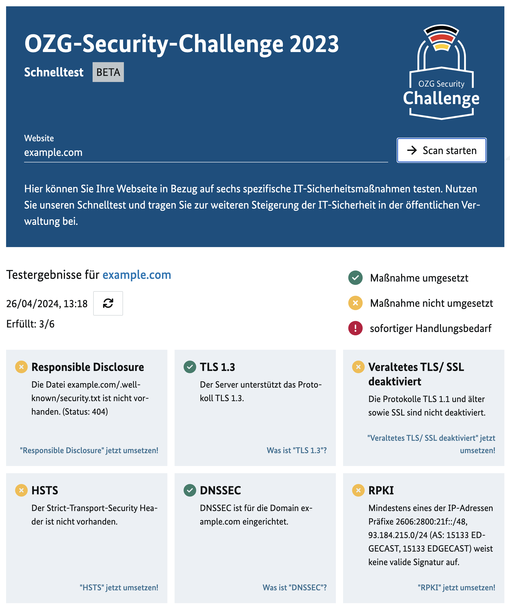
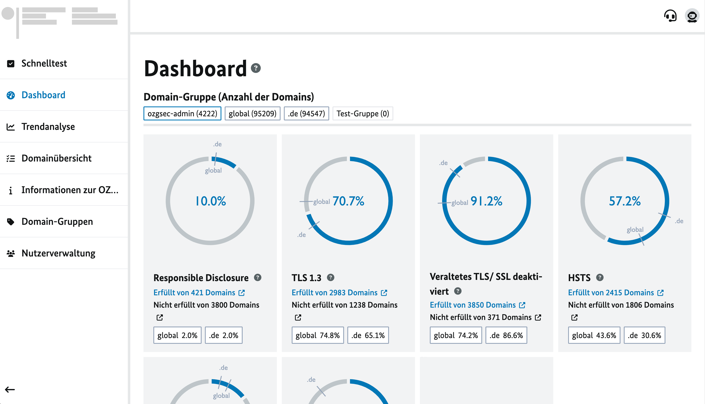
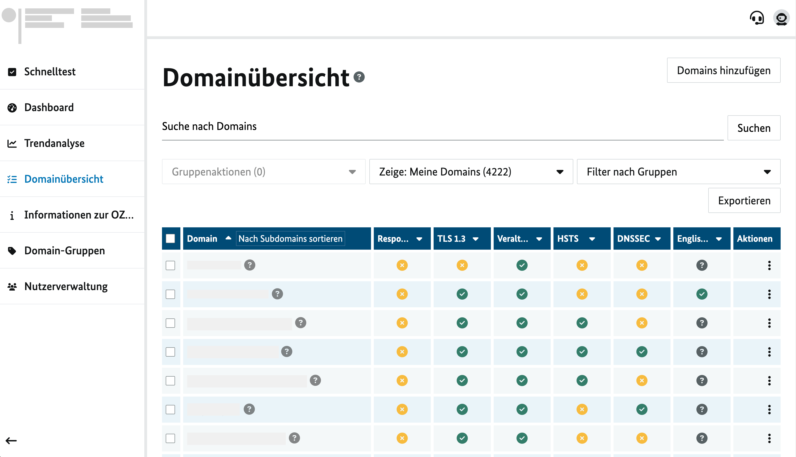
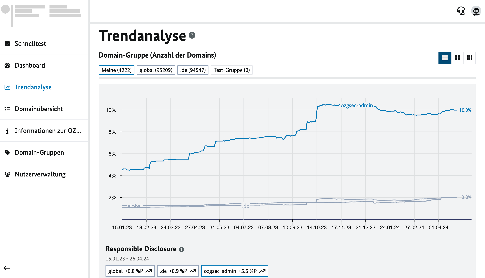
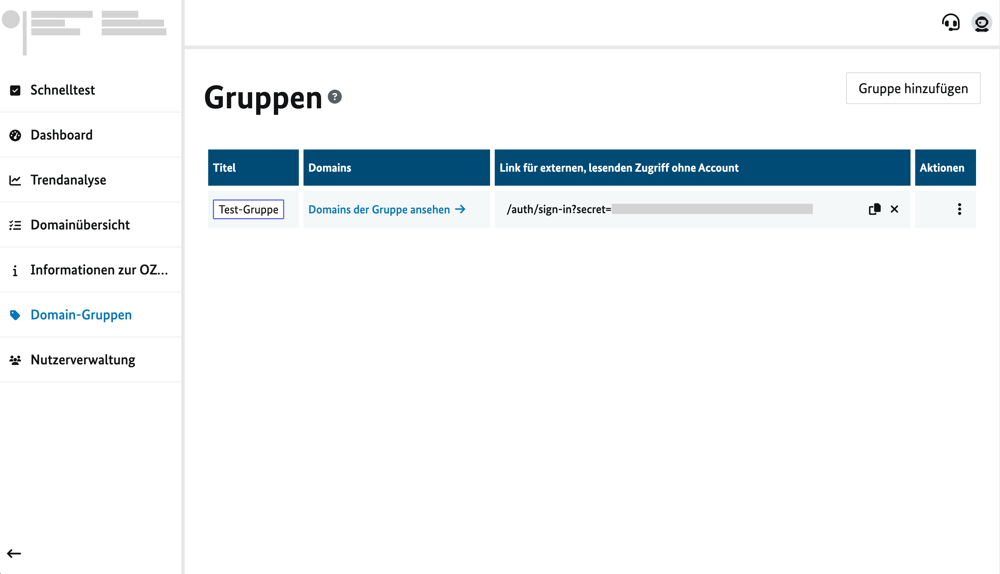

**Inhalte / Schnellnavigation**

[[_TOC_]]

# Features des OZG Security Challenge - Web Frontends

## Schnelltest 

Der Schnelltest ermöglicht das Prüfen des Umsetzungsgrades der sechs ausgewählten Maßnahmen einer spezifischen Domain. Nutzer:innen geben die Domain ein und erhalten nach wenigen Sekunden die Ergebnisse der Prüfung grafisch aufbereitet dargestellt. Die Darstellung unterscheidet dabei zwischen den drei Stufen: 

- Umgesetzt (grüner Haken): Die Maßnahme ist korrekt umgesetzt
- Nicht umgesetzt (gelbes Kreuz): Die Maßnahme ist nicht oder fehlerhaft umgesetzt. An dieser Stelle möchten wir den Hinweis geben, dass ein nicht Umsetzen keine unmittelbare Sicherheitsbedrohung o. Ä. ist, wohl aber Verbesserungspotenzial darstellt. 
- Sofortiger Handlungsbedarf (rotes Ausrufezeichen): Im Falle, dass kritische Maßnahmen nicht oder fehlerhaft umgesetzt sind, wird dies in einer roten Fehlermeldung angezeigt. Dies ist z. B. bei einem abgelaufenen TLS-Zertifikat der Fall. 

## Onepager

Zu den in der Challenge abgeprüften sechs Maßnahmen wurden sogenannte One-Pager erstellt. Diese erläutern jeweils auf einer Seite die Maßnahme zusammenfassend für eine Management-Ebene und detaillierter für Onlinedienstverantwortlichen. Je Maßnahmen wird außerdem ein technischer Umsetzungsansatz angegeben. Sie finden die One-Pager jeweils hier: 

- [Responsible Disclosure](../public/one-pager/Responsible_Disclosure-One-Pager.pdf)
- [Transport Layer Security (TLS) 1.3](../public/one-pager/TLS1_3-One-Pager.pdf)
- [TLS 1.0 & 1.1 deaktivieren](../public/one-pager/TLS1_1_off-One-Pager.pdf)
- [HTTP Strict Transport Security (HSTS)](../public/one-pager/HSTS-One-Pager.pdf)
- [Domain Name System Security Extensions (DNSSEC)](../public/one-pager/DNSSEC-One-Pager.pdf)
- [Resource Public Key Infrastructure (RPKI)](../public/one-pager/RPKI-One-Pager.pdf)

## Dashboard

Teil des Web Frontends ist die Dashboard-Funktion. Organisationen können Domains in einem Account hinterlegen (Import einer CSV ist möglich). Das System prüft dann diese Domains einmal am Tag und berechnet statistische Auswertungen. Im Dashboard wird konkret zusammengefasst, welcher prozentuale Anteil der hinterlegten Domains die Maßnahme umgesetzt hat. 

## Domainübersicht

Die Detail-Ergebnisse der hinterlegten Domains können in der „Domainübersicht“ ausgewertet werden. Hier können auch die hinterlegten Domains bearbeitet werden. Es stehen verschiedene Filterfunktionen zur Verfügung. Ein Export der gefilterten Ergebnisse als CSV ist ebenfalls möglich. 

## Trendanalysen

Mit der Funktion „Trendanalyse“ können die Ergebnisse der Prüfungen im Zeitverlauf ausgewertet werden. Wie auf dem Dashboard wird der prozentuale Anteil der Domains, welche die jeweilige Maßnahme korrekt umgesetzt haben, angezeigt. In die Graphen kann zur Detailansicht hineingezoomt werden. 

## Domaingruppen

In dem Tool ist es möglich, Domains zu gruppieren. Gruppen können frei angelegt werden. Die statistischen Auswertungen werden je Gruppe berechnet und in dem Dashboard sowie der Trendanalyse lassen sich die Gruppen vergleichen. Ergebnisse einer Gruppe können über einen Share-Link mit Dritten geteilt werden.

## API im SARIF-Format

Das Tool bietet eine API an, welche die Ergebnisse im SARIF-Format ausgibt. Das SARIF-Format ist ein Standardformat für die Ausgabe von statischen Analyseergebnissen. Es wird von vielen Tools unterstützt und kann in verschiedenen Tools zur weiteren Analyse und Visualisierung verwendet werden.

Beispiel eines Aufrufs: `curl http://localhost:3000/api/v2/scan\?site\=example.com`

Sie finden eine Beispiel-Antwort in der [example-v2-response.json](./assets/example-v2-response.json).

An dieser Stelle ist darauf hinzuweisen, dass aufgrund der Challenge Struktur des Projekts das Frontend nur die Ergebnisse der sechs für die Challenge ausgewählten Checks zurückgibt. Die separate [Scanner-Komponente](https://gitlab.opencode.de/bmi/ozg-rahmenarchitektur/ozgsec/ozgsec-best-practice-scanner) führt insgesamt mehr Checks durch und kann auch standalone verwendet werden.